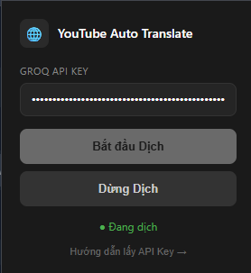
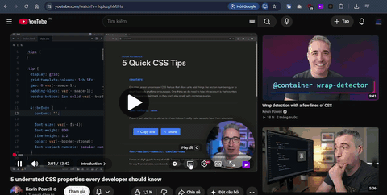

# YouTube Auto Translate

Người tạo: Nguyễn Văn Duy

YouTube Auto Translate là một tiện ích Chrome Extension giúp tự động dịch phụ đề YouTube sang tiếng Việt ngay trên video đang phát. Extension hoạt động bằng cách đọc phụ đề gốc của YouTube, gửi nội dung đến Groq API để dịch nhanh và hiển thị bản dịch trực tiếp lên video.

## Tính năng

- Tự động dịch phụ đề YouTube sang tiếng Việt
- Hiển thị bản dịch ngay trên video mà không cần mở tab riêng
- Hỗ trợ bật/tắt dịch nhanh từ popup của extension
- Tự động bật phụ đề gốc của YouTube để lấy nội dung dịch
- Dùng API key của người dùng để đảm bảo quyền kiểm soát và bảo mật

## Demo





## Yêu cầu

- Google Chrome hoặc Chromium
- Một tài khoản Groq API key để extension có thể dịch nội dung

## Cách cài đặt trên Chrome

1. Tải mã nguồn về máy hoặc clone repository:
   ```bash
   git clone https://github.com/your-username/youtube-auto-translator.git
   ```
2. Mở Chrome và truy cập: `chrome://extensions`
3. Bật chế độ "Developer mode"
4. Nhấn nút "Load unpacked"
5. Chọn thư mục chứa project này (thư mục có file `manifest.json`)
6. Extension sẽ xuất hiện trên thanh công cụ Chrome

## Cách sử dụng

1. Mở một video YouTube có phụ đề
2. Nhấn vào icon extension trên thanh công cụ
3. Nhập Groq API Key vào ô nhập liệu
4. Nhấn "Start" để bắt đầu dịch
5. Khi cần dừng, nhấn "Stop"

## Lưu ý

- Extension chỉ hoạt động tốt khi video YouTube có phụ đề gốc được bật
- Bạn cần có kết nối mạng để gọi Groq API
- Nếu chưa có API key, hãy tạo một key trên Groq trước khi sử dụng

## Tài liệu tham khảo

- Xem hướng dẫn API tại [api-guide.html](api-guide.html)
- Xem file mẫu cấu hình tại [config.example.js](config.example.js)
